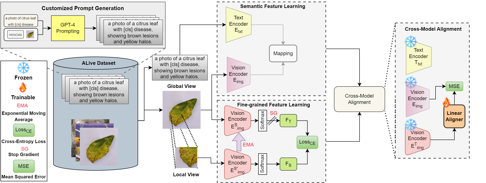

# AgriCLIP: Adapting CLIP for Agriculture and Livestock via Domain-Specialized Cross-Model Alignment

<p align="center">
    
</p>

#### [Umair Nawaz](https://scholar.google.com/citations?user=w7N4wSYAAAAJ&hl=en), [Awais Muhammad](https://scholar.google.com/citations?user=bA-9t1cAAAAJ&hl=en), [Hanan Gani](https://hananshafi.github.io/), [Muzammal Naseer](https://muzammal-naseer.com/), [Fahad Khan](https://sites.google.com/view/fahadkhans/home), [Salman Khan](https://salman-h-khan.github.io/), [Rao M. Anwer](https://scholar.google.fi/citations?user=_KlvMVoAAAAJ&hl=en)


[]([https://arxiv.org/abs/2410.01407](https://aclanthology.org/2025.coling-main.644.pdf))
[](https://mbzuaiac-my.sharepoint.com/:f:/g/personal/umair_nawaz_mbzuai_ac_ae/Ev3ZGFeLw8JPkda2RcRv_e0BR6yx25Hr0Pgrxdg6rrNOsA?e=CIuCb5)

---

## 📢 Latest Updates

- **Nov-01-24**: The paper is accepted to COLING 2025.
- **Oct-03-24**: AgriCLIP paper, pretraining dataset, and the code are released.

---

## Overview

We present AgriCLIP, a vision-language foundational model dedicated to the domain of agriculture and livestock. First, we propose a large-scale dataset, named ALive, that leverages customized prompt generation strategy to overcome the scarcity of expert annotations. Our ALive dataset covers crops, livestock, and fishery, with around 600,000 image-text pairs. Second, we propose a training pipeline that integrates both contrastive and self-supervised learning to learn both global semantic and local fine-grained domain-specialized features. Experiments on diverse set of 20 downstream tasks demonstrate the effectiveness of AgriCLIP framework.


<p align="center">
  
</p>


## 🏆 Contributions
1. Our primary contribution is the creation of a large, diverse image-text dataset derived solely from vision-based agricultural datasets. 
2. Our second contribution is a training pipeline that combines image-text contrastive and image-only self-supervised learning to boost global semantic features with fine-grained visual details.
3. We followed three-stage training pipeline, combining contrastive learning, DINO-based training, and encoders alignment to capture both global semantic and local fine-grained features.
4. We conduct comprehensive evaluation on different downstream tasks demonstrating AgriCLIP's effectiveness in zero-shot performance.

## 📂 ALive Dataset Access
We gather 25 training datasets across crops, fish, and livestock, creating the **A**griculture and **Live**stock (ALive) dataset with 600k images covering a wide range of conditions. This includes various crop growth stages, classifications, and different farming environments for animals and fish. Next, we design a customized prompt generation strategy where the text based on dataset and class-level information is leveraged to provide context and fine-grained details for each image. For instance, instead of using a generic CLIP prompt like “a photo of a boron-deficient leaf,” we craft prompts like “a photo of a leaf with boron deficiency, characterized by yellow patches and curled edges.” We then use GPT-4 to generate diverse variation of these prompts.

📥 **Download the Pre-Training Dataset:** Access our pre-training dataset: [ALive Dataset](https://mbzuaiac-my.sharepoint.com/:f:/g/personal/umair_nawaz_mbzuai_ac_ae/Ev3ZGFeLw8JPkda2RcRv_e0BR6yx25Hr0Pgrxdg6rrNOsA?e=CIuCb5).

To evaluate the performance of AgriCLIP, we assemble a set of 20 datasets (Downstream data) to test the model’s ability to generalize to unseen concepts. The evaluation set is entirely disjoint from the ALive pre-training set. 

<p align="center">
  
</p>

<p align="center">
  
</p>

📥 **Download the Downstream data:** Access our downstream dataset: [Downstream Dataset](https://mbzuaiac-my.sharepoint.com/:f:/g/personal/umair_nawaz_mbzuai_ac_ae/Eopq16hBlqpCuGv0UYqqRkIBRryT9Pum3HxtgWN4YJAWqg?e=XwdvVa).


<!-- ## 🧠 Model Zoo
| Model Name       | HuggingFace Link                                     |
|------------------|------------------------------------------------------|
| MobilePALO-1.7B  | [MBZUAI/MobilePALO-1.7B](https://huggingface.co/MBZUAI/MobilePALO-1.7B) |
| PALO-7B          | [MBZUAI/PALO-7B](https://huggingface.co/MBZUAI/PALO-7B)   |
| PALO-13B         | [MBZUAI/PALO-13B](https://huggingface.co/MBZUAI/PALO-13B) |
 -->

## 🔧 Installation
We recommend setting up a conda environment for the project:

```bash
conda create --name=agriclip python=3.10
conda activate agriclip

git clone https://github.com/umair1221/AgriCLIP.git
cd AgriCLIP

pip install -r requirements.txt

export PYTHONPATH="./:$PYTHONPATH"
```


## 🚋 Training
**1. Prepare data**

Please download the dataset from [ALive Dataset](https://mbzuaiac-my.sharepoint.com/:f:/g/personal/umair_nawaz_mbzuai_ac_ae/Evc0EuEPvtdJuNYm7gmHVwQBbbI26UILyiQts137dZXMFQ?e=capaMN).


After downloading, the next step is to get the features representations for both the models i.e., the DINO and the CLIP.
Then run the following command to get the aligned model as an output which will be then used for the zero-shot evaluation.
```bash
python AgriCLIP_alignment/train_linear_aligner.py --data-path "/path/to/your/dataset" \
                               --dino-weights-path "/path/to/your/dino_pretrain.pth" \
                               --clip-weights-path "/path/to/your/dino_pretrain.pth" \
                               --path-dino-features "/path/to/your/dino_features.npy" \
                               --path-clip-features "/path/to/your/clip_features.npy" \
                               --output-model-path "./path/to/save/aligned_model.pth"
```

## 🔧 Download Downstream Dataset
Downstream datasets can either be downloaded manually from here [Downstream-Data](https://mbzuaiac-my.sharepoint.com/:f:/g/personal/umair_nawaz_mbzuai_ac_ae/Eopq16hBlqpCuGv0UYqqRkIBRryT9Pum3HxtgWN4YJAWqg?e=2PfqgH) or by using the script below:

```bash
pip install gdown 

python Dataset/download_downstream.py --output-dir "/path/to/your/dataset/storage"

```
## 💿 Perform Zero-Shot Classification on AgriCLIP
Please use the below command to perform zero-shot inference on AgriCLIP.

```bash
python AgriCLIP_alignment/AgriClip_zeroshot.py --dataset-name "Banana Deficiency" \
              --data-path "/path/to/dataset" \
              --dino-path "Weights/dino_pretrain.pth" \
              --aligner-path "/Weights/Aligned_Models/Agri_Dino_aligner_DPT_CPT.pth" \
              --batch-size 32 \
              --num-workers 4

```


## 💿 Model Zoo

| Model Name       | Weights                                                       |
|------------------|-------------------------------------------------------------------------|
| DINO  | [Pre-Trained Dino Weights](https://mbzuaiac-my.sharepoint.com/:u:/g/personal/umair_nawaz_mbzuai_ac_ae/EaMwAZzvW6xBpVNv539sZ0kBlU7usSPyzZGj2gwUYPz7wg?e=kcai5A) |
| CLIP  | [Pre-Trained CLIP Weights](https://mbzuaiac-my.sharepoint.com/:u:/g/personal/umair_nawaz_mbzuai_ac_ae/EQDAP4euPbNFvrRJr0Ns4AgBzdY1KHyiw0U1tM92I4eUvg?e=KxbbSb) |
| AgriCLIP         | [Aligned AgriCLIP Weights with Pre-Trained DINO and CLIP](https://mbzuaiac-my.sharepoint.com/:u:/g/personal/umair_nawaz_mbzuai_ac_ae/EaSxj1qqeblBoK-e4ye7JjUBxpKjUvtRzHf0V5cTSpnDyA?e=ukhngF)                 |
| AgriCLIP         | [Aligned AgriCLIP Weights with Pre-Trained DINO and Default CLIP](https://mbzuaiac-my.sharepoint.com/:u:/g/personal/umair_nawaz_mbzuai_ac_ae/EYdN0JsOcLdPpqcBplxK7PwBkyG1w2nib_fNVR6F06ndwA?e=pHbT1X)                 |
| AgriCLIP         | [Aligned AgriCLIP Weights with Default DINO and Pre-Trained CLIP](https://mbzuaiac-my.sharepoint.com/:u:/g/personal/umair_nawaz_mbzuai_ac_ae/ET02EORvYOJMmiEikmq6TCkByUzBc-AyxLGjlyDZoa3p9w?e=fKqyQj)                 |
| AgriCLIP         | [Aligned AgriCLIP Weights with Default DINO and Default CLIP](https://mbzuaiac-my.sharepoint.com/:u:/g/personal/umair_nawaz_mbzuai_ac_ae/ERKuUr7UW_lPtdw755_xK4UBnLVYr1G7qEutAnObLJ9QPg?e=k7sTax)                 |


## Feature Representations
| Model Name       | Weights                                                       |
|------------------|-------------------------------------------------------------------------|
| DINO  | [Features representations of ALive Data for alignment purpose](https://mbzuaiac-my.sharepoint.com/:u:/g/personal/umair_nawaz_mbzuai_ac_ae/EdZlaeWmuFNPnjoshCtI3A0Bb_xWSt0slydHw_VVARjnLg?e=qC1NOV) |
| CLIP  | [Features representations of ALive Data for alignment purpose](https://mbzuaiac-my.sharepoint.com/:u:/g/personal/umair_nawaz_mbzuai_ac_ae/EWm2lNa2c9tNg9G37UoirQcBRADyJb6RlQfSQkckuYiLKQ?e=w85sNL)                 |


## Acknowledgements :pray:

+ [Text2Concept](https://github.com/k1rezaei/Text-to-concept): Our approach is inspired from this work. We are thankful for their Cross-Model alignment code.
+ [Dino](https://github.com/facebookresearch/dino): Provides with the capability of using self-supervised training.
+ [CLIP](https://github.com/mlfoundations/open_clip): A good resource for zero-shot classification using text prompts.


## 📜 Citation
```bibtex
    @misc{nawaz2024agriclip,
      title={AgriCLIP: Adapting CLIP for Agriculture and Livestock via Domain-Specialized Cross-Model Alignment}, 
      author={Umair Nawaz and Muhammad Awais and Hanan Gani and Muzammal Naseer and Fahad Khan and Salman Khan and Rao Muhammad Anwer},
      year={2024},
      eprint={2410.01407},
      archivePrefix={arXiv},
      primaryClass={cs.CV},
      url={https://arxiv.org/abs/2410.01407}, 
}
```
